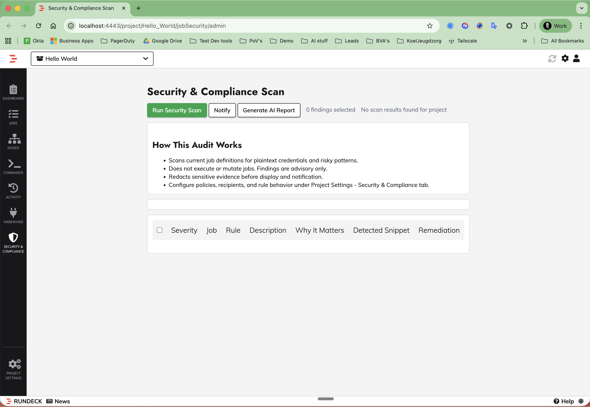
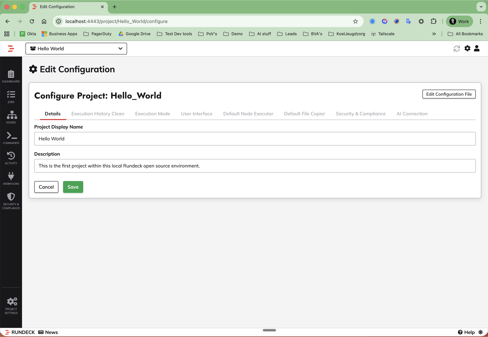

<h1 align="center">Rundeck Security & Compliance Audit Plugin</h1>

<p align="center">
  <strong>Static security and compliance scanning for Rundeck jobs, with activity-backed audit runs, notifications, custom rules, policy controls, and AI-enriched reporting.</strong>
</p>

<p align="center">
  <a href="#installation">Installation</a> •
  <a href="#uninstall">Uninstall</a> •
  <a href="#features">Features</a> •
  <a href="#project-configuration-tabs">Project Tabs</a> •
  <a href="#build-from-source">Build</a> •
  <a href="#release-notes">Release Notes</a>
</p>

<p align="center">
  
  
  
</p>

---

## Overview

This plugin adds a dedicated **Security & Compliance** capability to Rundeck projects.

It scans existing job definitions and current project data without introducing database schema changes.
Each scan is recorded as a normal Rundeck execution so results appear naturally in **Activity/History**.

The plugin provides:

- security and compliance rule scanning for jobs
- activity-backed audit executions
- risk scoring and severity classification
- per-project rule controls and policy-as-code YAML
- custom admin-defined regex rules
- manual webhook/email notification flow
- AI-enriched report generation with preview and download
- provider-aware AI connection settings for OpenAI, Anthropic, Google AI, and custom endpoints

## Screenshots

### Security & Compliance scan page



### Project configuration tabs



## Features

- Left navigation entry: `Security & Compliance`
- Manual scan execution only
- Findings stored without DB schema changes
- Built-in detection for:
  - inline secrets and plaintext credentials
  - root and privileged execution
  - unrestricted sudo
  - unsafe shell constructs
  - wildcard destructive commands
  - exposed environment variable secrets
  - plaintext credential files
  - unpinned Git sources
  - unrestricted node targeting
  - policy violations and blast radius checks
- Custom severity overrides per rule
- Custom admin-defined rules
- AI report generation:
  - management summary
  - technical details
  - prioritized suggestions
  - markdown and text downloads
- AI connection diagnostics:
  - model discovery
  - connection test
  - key diagnostics

## Compatibility

| Platform | Version |
|----------|---------|
| Rundeck Community | 5.x |
| Runbook Automation (Self-Hosted) | 5.x |

## Installation

Download the latest JAR from [Releases](https://github.com/rundecktoolkit/plugin-security-compliance-audit/releases) and install it through Rundeck:

1. Open **System Menu -> Plugins -> Upload Plugin**
2. Upload `plugin-security-compliance-audit-1.0.0.jar`
3. Reload or restart Rundeck if your deployment does not hot-load UI plugins

Alternative filesystem install:

1. Copy the JAR into `$RDECK_BASE/libext/`
2. Restart Rundeck

## Uninstall

1. Open **System Menu -> Plugins** and remove or disable `plugin-security-compliance-audit`
2. Or delete the JAR from `$RDECK_BASE/libext/`
3. Restart Rundeck if required by your deployment
4. Optional cleanup: remove `project.plugin.JobSecurityAudit.*` project properties

## Project Configuration Tabs

Inside **Project Settings -> Configure Project**, the plugin adds two tabs:

1. **Security & Compliance**
- Notification owner and webhook settings
- Rule groups and per-rule severity overrides
- Policy YAML
- Custom rules
- `Enable AI Report Enrichment`
- Prompt template used for generated reports

2. **AI Connection**
- Provider selection:
  - OpenAI
  - Anthropic
  - Google AI
  - Custom
- `LLM Endpoint URL`
- `Model` and `Discover`
- `Username (optional)`
- `Vault API Key Path`
- `Test Connection`
- `Diagnose Key`

## Usage

1. Open **Security & Compliance** from the project navigation
2. Run a security scan
3. Review findings and select the relevant risks
4. Generate an AI report if required
5. Download the report or notify via webhook/email

## Data Handling

- No inline API keys are stored in project settings
- Vault integration stores only the key path, not the secret value
- Findings sent to AI providers are masked/redacted
- This repository does not contain runtime project configuration, vault contents, or local test secrets

## Build from Source

This repository contains the plugin source module and release assets.
The authoritative build currently happens inside a Rundeck OSS source checkout because the plugin depends on Rundeck internal modules.

### Build using a Rundeck OSS checkout

```bash
cd /path/to/rundeck
source ./.java11-env.sh
./gradlew :grails-job-security-audit:assemble
```

Generated artifact:

```text
grails-job-security-audit/build/libs/grails-job-security-audit-5.20.0-SNAPSHOT-plain.jar
```

For release packaging, rename the artifact to:

```text
plugin-security-compliance-audit-1.0.0.jar
```

## Repository Layout

```text
plugin-security-compliance-audit/
  LICENSE
  README.md
  build.gradle
  docs/
    SecurityComplianceScannerFramework.md
    release-notes-v1.0.0.md
  grails-app/
  scripts/
    publish-github-release.sh
  src/
```

## Release Notes

- [v1.0.0](./docs/release-notes-v1.0.0.md)

## Support

- Issues: [GitHub Issues](https://github.com/rundecktoolkit/plugin-security-compliance-audit/issues)
- Organization: [rundecktoolkit](https://github.com/rundecktoolkit)

## License

Apache License 2.0 - see [LICENSE](./LICENSE)

---

<p align="center">
  <sub>Part of <a href="https://github.com/rundecktoolkit">rundecktoolkit</a> — Community plugins for Rundeck</sub>
</p>
